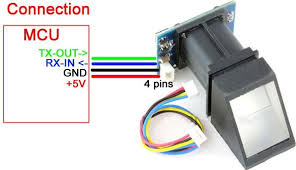
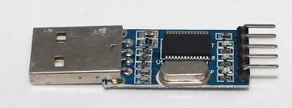
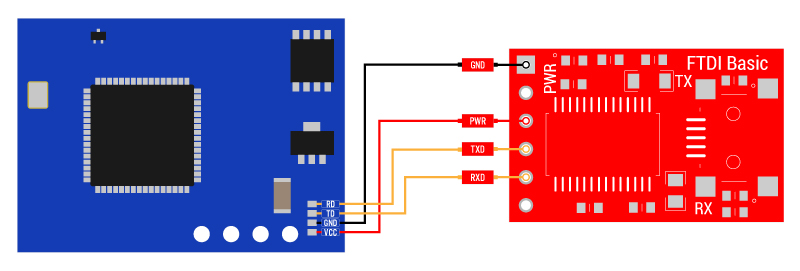
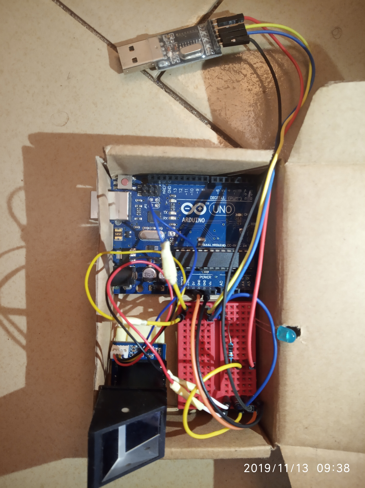
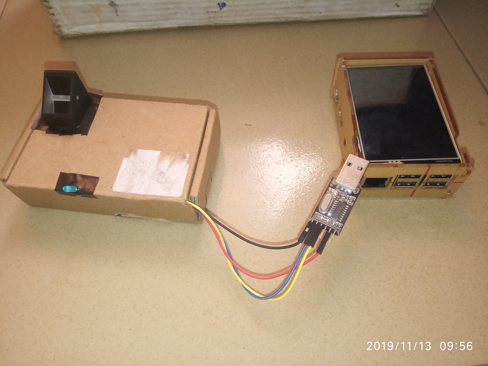

Hardware
========

This section lists and explains the minimum hardware and connection
requirements needed to work with this library.

Requirements
____________

* **r305 fingerprint module**

* **USB to TTL converter**

Connections
___________

The minimum connection to get started is to:
    1. Connect the **RX-IN** of the r305 to the **TXD** of the converter
    2. Connect the **TX-OUT** of r305 to the **RXD** of the converter
    3. Connect both grounds (**GND**), and
    4. Connect both powers (**VCCs**)

A Few Checks
++++++++++++

The USB TTL receives power once plugged in. The power from the USB TTL
converter may not be enough, depending on your usb port on upper computer
(Raspberry or Laptop), to power the r305. Hence you may need to power the
r305 with an external power source of 5V.

In the image below, we power the r305 module with an arduino instead,
via the 5V VCC on the arduino UNO board, and that's all the arduino is
doing there.

The other connections you may see, like the LED and resistor are just
connections to indicate that the module is powered, to give a visual on
when the whole system is powered on or off.

Below is a complete package using Raspberry Pi 3 as upper computer.

.. Note::
    Once the USB TTL converter is connected to upper computer, and you
    run your program (or e.g any one of the :ref:`example_codes`),
    depending on your systems settings, you may need to change the
    permissions of the port to allow serial connection and communication.
    You might find yourself having to this everytime you unplug and plug
    back the converter, so you could find a way to automate this.

And that'll be all the hardware and it's connection you need to set up.

It's fair to say that the implementation of this library does not cover
all the functionalities of the r305, it does cover a good number of the
fingerprint processing insturctions for most use cases. In that regard,
if you would want to know more about the r305, its operations, extra
capabilities and maybe lower level implementation details of the library,
you can have a look in the datasheet, we have a copy on the github repo
`here <https://github.com/cerebrohivetech/adafruit-fingerprint/blob/master/finger-print-module.pdf>`_.
